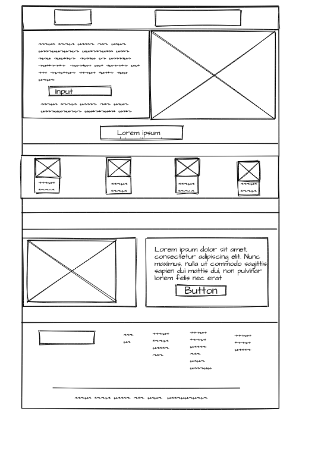

# Landing-Proyecto-1

## 1.Introducción
Este es un prototipo basado en un ecommerce con la finalidad de vender articulos decorativos para el hogar.
## 2.Sections 
 **Header.**
- Este espacio esta compuesto por el nombre-logo de la empresa y también por un menú de navegación.

**Jumbotron.**
-  Esta sección está conformada por título, rutas de navegacion, input donde le permite al usuario ingresar su email para recibir información de las novedades mas recientes, imagen de presentación .

 **Block.** 
- En la parte de block esta situado un catalogo con diferentes articulos.

 **Adicionales.**
- En Adicionales podemos encontrar una sección compuesta por artículos, imagen que hace referencia a "Delivery", h1, h2, h3, y enlace de contacto.

 **Footer.**
 - Footer es la ultima sección y donde finaliza la página web, en esta podemos encontrar enlaces que hacen referencia a las redes socilaes la cual el cliente puede acceder con la finalidad de contactarse con la empresa o enterarse de las novedades mas y ofertas .

## 3.Tecnologias usadas

- HTML
- CSS

## 4.Website 
https://joan-corporan.github.io/PROYECTO-1/

## 5.Agradecimientos

Quisiera agradecer al profesor de la universidad, **Daniel Sepúlveda Pérez** por su **paciencia** y **esfuerzo**.

